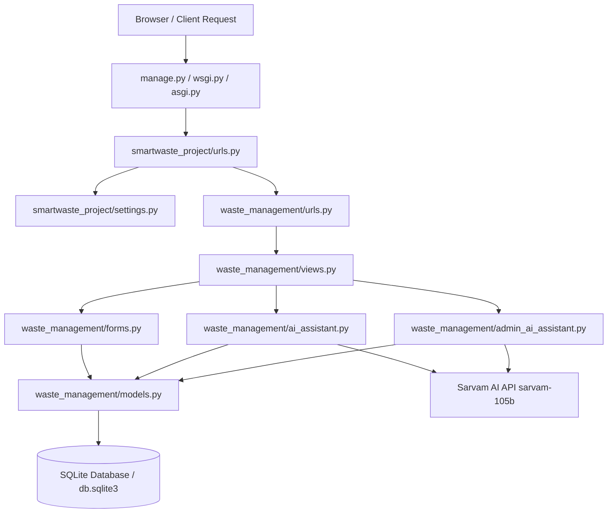

# 🏗️ CleanLoop Backend Architecture & Module Guide

This document provides a detailed breakdown of the CleanLoop backend architecture, explaining the role of every file and how all modules work together to handle citizen reports, doorstep pickups, municipal control operations, and Sarvam AI integrations.

---

## 📐 Overall System Architecture & Data Flow

---

## 📁 File-by-File Breakdown

### 1. Root Backend (`backend/`)

* **`backend/manage.py`**
  - **Purpose**: Django's command-line utility for administrative tasks.
  - **Function**: Executes server startup (`runserver`), database migrations (`migrate`), test suites (`test`), and static file collection (`collectstatic`).

---

### 2. Core Project Configuration (`backend/smartwaste_project/`)

* **`smartwaste_project/settings.py`**
  - **Purpose**: Central configuration for the entire Django project.
  - **Function**: Loads environment variables from `.env` (such as `SARVAM_API_KEY` and `SECRET_KEY`), configures `INSTALLED_APPS`, database connection (`db.sqlite3`), static asset paths (`STATIC_URL`, `STATICFILES_DIRS`), session security, and media upload paths.

* **`smartwaste_project/urls.py`**
  - **Purpose**: Master URL dispatcher for the web application.
  - **Function**: Maps root HTTP paths (`/`, `/auth/`, `/citizen/`, `/pickup/`, `/track/`, `/admin-dashboard/`, `/ai/`, `/guide/`, `/api/`) to views in `waste_management.views`.

* **`smartwaste_project/wsgi.py` & `asgi.py`**
  - **Purpose**: Web server gateway interfaces for deployment.
  - **Function**: Provides WSGI/ASGI entrypoints for production servers like Gunicorn, Daphne, and Nginx.

* **`smartwaste_project/__init__.py`**
  - **Purpose**: Marks `smartwaste_project` as a Python package.

---

### 3. Business Logic Application (`backend/waste_management/`)

* **`waste_management/models.py`**
  - **Purpose**: Defines the database schema and data models.
  - **Key Classes**:
    - `UserProfile`: Extends Django's `User` model with phone number, address, role (`is_admin_staff`), and citizen metadata.
    - `Complaint`: Stores waste issues (category, description, lat/lng GPS, landmark, photo, status, priority, assigned crew).
    - `PickupRequest`: Stores doorstep pickup requests (waste category, estimated weight, date, time slot, vehicle assignment, status).
    - `ComplaintUpdate`: Maintains an audit trail/history of status changes and crew notes for tracking.

* **`waste_management/views.py`**
  - **Purpose**: Handles HTTP requests, processes web forms, renders HTML pages, and serves JSON APIs.
  - **Function**:
    - Serves pages like Landing (`/`), Citizen Portal (`/citizen/`), Admin Dashboard (`/admin-dashboard/`), Guide (`/guide/`), etc.
    - Handles User Auth: Login, Registration, Logout.
    - API endpoints: `/api/ai/chat/`, `/api/admin-ai/chat/`, `/api/complaints/`, `/api/pickups/`, `/api/health/`.

* **`waste_management/ai_assistant.py`**
  - **Purpose**: Powers the Citizen AI Assistant (`/ai/` and `/democitizenai/`).
  - **Function**:
    - Manages state machine for multi-step waste reporting & pickup scheduling in chat.
    - Integrates with Sarvam AI (`sarvam-105b`) via HTTP REST calls (`https://api.sarvam.ai/v1/chat/completions`).
    - Handles small talk, waste segregation guidance, and intent classification.

* **`waste_management/admin_ai_assistant.py`**
  - **Purpose**: Powers the Municipal Control Room AI (`/admin-ai/` and `/demoadmin/`).
  - **Function**:
    - Computes real-time municipal metrics: Active hotspots, pending complaints, Ward EHI scores.
    - Allows municipal officers to dispatch crews (`WM-2026-XXXX`) and assign vehicles (`PK-2026-XXXX`) via conversational AI.
    - Uses Sarvam AI for municipal administration guidance.

* **`waste_management/forms.py`**
  - **Purpose**: Form validation and input sanitization.
  - **Function**: Contains `CitizenRegistrationForm`, `ComplaintForm`, and `PickupRequestForm` for validating user inputs before saving to the database.

* **`waste_management/urls.py`**
  - **Purpose**: App-level route definitions.

* **`waste_management/admin.py`**
  - **Purpose**: Registers models with Django's default Admin Interface (`/admin/`).

* **`waste_management/tests.py`**
  - **Purpose**: Automated unit testing suite.
  - **Function**: Validates models, view routes, form inputs, status transitions, and API response structures.

* **`waste_management/routing.py`**
  - **Purpose**: WebSocket URL routing configuration.

---

## 🔄 How the Modules Work Together (Execution Walkthroughs)

### Scenario A: Citizen Reports a Waste Issue
1. **User Action**: Citizen fills out waste form or uses GPS location on `/citizen/`.
2. **Routing**: Request hits `smartwaste_project/urls.py` ➔ routed to `waste_management/views.py` (`report_waste_view`).
3. **Validation**: `views.py` passes POST data to `waste_management/forms.py` (`ComplaintForm`).
4. **Data Saving**: Once valid, `forms.py` saves a new record to `waste_management/models.py` (`Complaint`).
5. **Response**: User receives confirmation with a unique Complaint ID (`WM-2026-XXXX`).

---

### Scenario B: Citizen Asks AI Assistant ("e-waste kahan phenke?")
1. **User Action**: Citizen types message in `/ai/`.
2. **API Endpoint**: Frontend sends POST request to `/api/ai/chat/` (`views.py` ➔ `api_ai_chat_view`).
3. **AI Router**: `views.py` invokes `waste_management/ai_assistant.py` (`run_ai_chat`).
4. **Sarvam AI Processing**: `ai_assistant.py` formats prompt with CleanLoop waste rules and sends request to Sarvam AI API (`https://api.sarvam.ai/v1/chat/completions`).
5. **Response**: `ai_assistant.py` parses response and returns clean JSON reply to the frontend.

---

### Scenario C: Municipal Officer Queries Active Hotspots
1. **Officer Action**: Officer types `"show active hotspots"` in `/admin-ai/`.
2. **API Endpoint**: Frontend sends POST to `/api/admin-ai/chat/` (`views.py` ➔ `api_admin_ai_chat_view`).
3. **Admin AI Router**: `views.py` calls `waste_management/admin_ai_assistant.py` (`run_admin_ai_chat`).
4. **ORM Aggregation**: `admin_ai_assistant.py` queries `models.py` (`Complaint.objects.exclude(status='RESOLVED').values('location').annotate(Count('id'))`).
5. **Response**: Formatted hotspot cluster card returned live to the officer's control screen.
